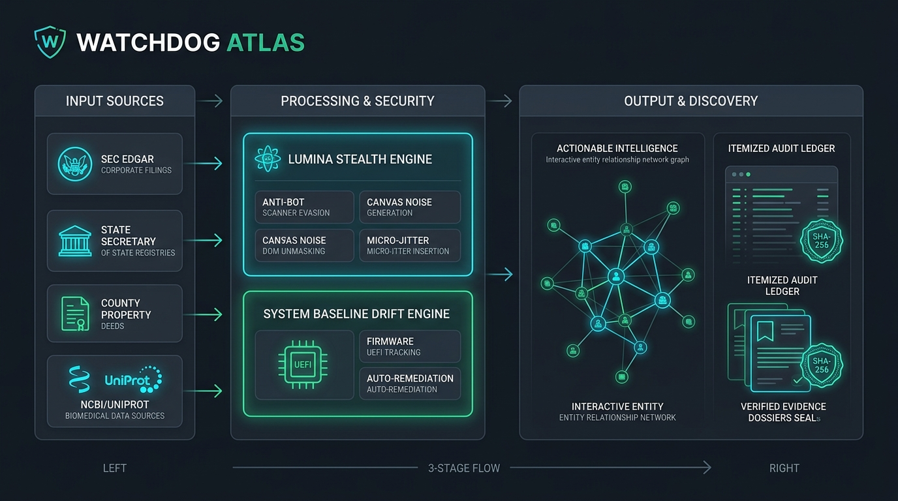
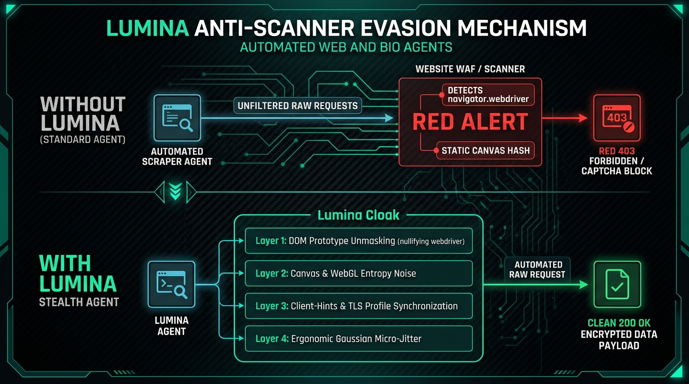
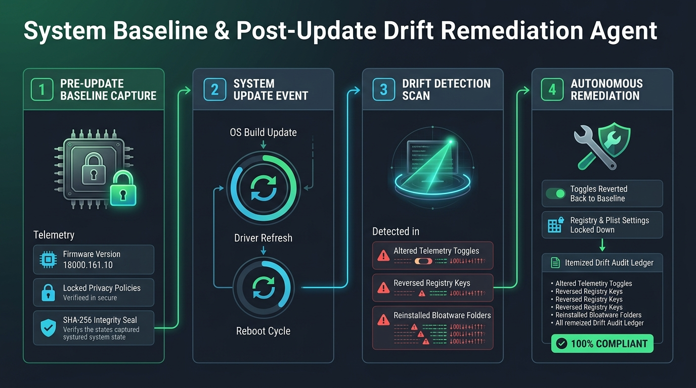

# web-and-bios-scrapper-: Watchdog Corruption Atlas & Lumina Stealth Engine

[](#1-lumina-anti-scanner-evasion-engine-scriptslumina_stealthpy)
[](#4-system-baseline--post-update-drift-remediation-scriptsdrift_remediationpy)
[](#repository-structure)
[](docs/INSTALLATION_AND_TROUBLESHOOTING_MOP.md)

An automated public-records intelligence platform and anti-bot scanner evasion engine designed for cross-platform deployment across **macOS** and **Windows**. Integrates **Lumina Stealth** fingerprint harmonization, dedicated **Web (Corporate & Property)** and **Bio's (Biomedical & Biochemical)** harvesters, automated **System Baseline & Drift Remediation**, and a standalone **Single-Page Interactive Atlas UI**.

---

## Architecture & Dataflow: From Input to Output



### 3-Stage Input-to-Output Lifecycle

1. **Stage 1: Input Ingestion**
   - **Public Corporate Registries (Web):** SEC EDGAR REST API submissions (CIK, Form 4, 10-Q, 13F), Delaware Division of Corporations (ICIS entity files), Nevada Secretary of State (SilverFlume trust & business entities).
   - **Public Property Tax Assessors (Web):** Douglas County & Shelby County GIS / parcel tax databases ($48.25M HQ parcels).
   - **Public Biomedical Repositories (Bio's):** UniProtKB protein accession IDs, NCBI nucleotide/gene registries, ChEMBL bioactive molecular queries.
   - **Host Hardware & Firmware Telemetry:** Apple Silicon `SPHardwareDataType` / Windows WMI `Win32_BIOS` firmware versions (`18000.161.10`), OS builds (`25G83`), and preference domain plists / registry hives.

2. **Stage 2: Processing, Evasion & Integrity**
   - **Lumina Stealth Engine:** Strips automation artifacts (`navigator.webdriver`), injects 1-bit boundary noise into 2D canvas exports, spoofs WebGL GPU vendors (`ANGLE (Apple, Apple M2)`), harmonizes Client-Hints (`Sec-CH-UA`), and inserts Gaussian micro-jitter delays (`mean=2.5s`).
   - **System Baseline Drift Engine:** Captures pre-update states into SHA-256 cryptographic manifests, detects post-update setting reversals or bloatware restorations, and executes autonomous policy rollbacks.

3. **Stage 3: Output & Discovery**
   - **Interactive Entity Network Graph:** Force-directed visualization mapping relationships across corporate parent entities, subsidiaries, corporate officers, registered agents, and titled real estate parcels.
   - **Itemized Post-Run Audit Ledgers:** Structured JSON logs documenting scan timestamps, drift counts, and confirmed restored configurations.
   - **Verified Evidence Dossiers:** Downloadable and inspectable public filing payloads sealed with SHA-256 cryptographic checksums.

---

## 1. Lumina Anti-Scanner Evasion Engine (`scripts/lumina_stealth.py`)



Prevents automated scanners (Cloudflare Turnstile, DataDome, Akamai, PerimeterX, AWS WAF, and standard headless browser detectors) from flagging or blocking harvesting agents:

* **DOM & Navigator Prototype Hardening:**
  * Deletes `navigator.webdriver` from prototype chain and replaces with undefined getter.
  * Overrides `navigator.permissions.query` to prevent notification permission leaks.
  * Masks `navigator.plugins`, `navigator.languages`, `navigator.hardwareConcurrency`, and `navigator.deviceMemory`.
  * Purges global automation symbols (`__webdriver_evaluate`, `_selenium`, `cdc_` and `$cdc_` Chrome driver tokens).
* **Canvas & WebGL Fingerprint Noise:**
  * Applies high-entropy 1-bit boundary noise to `HTMLCanvasElement.prototype.toDataURL` to break deterministic canvas fingerprinting.
  * Spoofs WebGL unmasked vendor (`Google Inc. (Apple)`) and renderer (`ANGLE (Apple, Apple M2, OpenGL 4.1)`).
* **Client-Hints & TLS Harmonization:**
  * Synchronizes `Sec-CH-UA`, `Sec-CH-UA-Platform`, and `Sec-CH-UA-Mobile` with modern desktop browser signatures.
* **Ergonomic Trajectories & Micro-Jitter:**
  * Implements Gaussian request delays (`mean=2.5s`, `sigma=0.8s`) preventing behavioral pattern detection.

### Run Lumina Audit
```bash
# Run 6-point anti-scanner evasion self-audit
python3 scripts/lumina_stealth.py --audit
```

---

## 2. Web's Public Records Harvester (`scripts/web_scraper.py`)

Dedicated harvester for federal and state public corporate registrations and land registries:

* **SEC EDGAR Company Intelligence:** Automatically indexes CIK corporate profiles, IRS EINs, SIC industry codes, and recent official filings (Form 4, 10-Q, 13F).
* **State Corporate Registries:** Ingests Delaware Division of Corporations (ICIS) and Nevada Secretary of State filings with commercial registered agent mappings.
* **County Real Property Assessors:** Ingests property parcel assessments, land use classifications, and assessed valuations.

### Run Web Harvester Commands
```bash
# Run automated sample harvest (Berkshire Hathaway & Apple Inc)
python3 scripts/web_scraper.py --harvest-samples

# Query a custom corporate CIK
python3 scripts/web_scraper.py --sec 0001067983

# Query a Delaware corporate filing number
python3 scripts/web_scraper.py --state-file 2919864
```

---

## 3. Bio's Biomedical Public Records Harvester (`scripts/bio_scraper.py`)

Dedicated harvester for public biological, genetic, and pharmacological data repositories:

* **UniProt Knowledgebase (UniProtKB):** Protein sequence length, molecular weight (Da), gene nomenclature, and scientific organism taxonomy.
* **EMBL-EBI ChEMBL API:** Bioactive chemical structures, SMILES notation, molecular formulas, and FDA clinical development phases.
* **NCBI Entrez Gene:** Human genetic locus, chromosome location, official gene symbols, and functional descriptions.

### Run Bio Harvester Commands
```bash
# Harvest representative biomedical samples (APP Protein, Aspirin, APP Gene)
python3 scripts/bio_scraper.py --harvest-samples

# Query a specific protein by UniProt Accession
python3 scripts/bio_scraper.py --uniprot P05067

# Query a bioactive compound by ChEMBL ID
python3 scripts/bio_scraper.py --chembl CHEMBL25

# Query an official gene by NCBI Gene ID
python3 scripts/bio_scraper.py --ncbi-gene 351
```

---

## 4. System Baseline & Post-Update Drift Remediation (`scripts/drift_remediation.py`)



Monitors the local operating environment to ensure updates do not reverse user configurations or re-enable telemetry:

* **Pre-Update Baseline Tracking:** Records system firmware/BIOS, OS build, locked privacy policies, and blocked bloatware into [`data/system_baseline.json`](data/system_baseline.json).
* **Post-Update Drift Detection:** Scans host following OS, firmware, or driver updates to detect altered settings.
* **Automated Remediation:** Silently or interactively re-enforces baseline security policies and removes unwanted services.
* **Itemized Audit Ledger:** Emits post-run verification details to [`data/drift_audit_log.json`](data/drift_audit_log.json).

### Run Drift Remediation Commands
```bash
# Capture fresh machine baseline
python3 scripts/drift_remediation.py --baseline

# Check real-time compliance status
python3 scripts/drift_remediation.py --status

# Scan and remediate any detected drift
python3 scripts/drift_remediation.py --remediate
```

---

## 5. Method of Procedure (MOP): Installation & Troubleshooting Runbook

For enterprise deployment, environment verification, and incident diagnosis, refer to the complete **Method of Procedure (MOP)**:

👉 **[Read the Installation & Troubleshooting MOP Runbook](docs/INSTALLATION_AND_TROUBLESHOOTING_MOP.md)**

### Key Topics in MOP:
* **MOP Checklist:** 5 standard operational verification steps (Lumina self-audit, Web Harvester, Bio Harvester, Baseline Scan, UI launch).
* **Troubleshooting Matrix (TR-01 to TR-08):** Step-by-step remediations for HTTP 403 blocks, gzip byte streams, GitHub PAT permissions, macOS Apple Silicon firmware discovery, Windows PowerShell execution policies, port conflicts, and HTTP 429 rate limits.

---

## 6. Interactive Web & Bio Visualizer (`index.html`)

A single-file, zero-dependency dashboard built with Tailwind CSS, Lucide icons, Vis.js, and Google Fonts (`Outfit`, `Inter`, `JetBrains Mono`) adhering to `/ui-pro-max` design principles:

* **Dual-Domain Traversal & Nexus Engine:** Instant switching between **Corporate Ownership (Web)**, **Biomedical & Genomic Targets (Bio)**, and **Cross-Domain Sponsorship Nexus**.
* **Biomedical Interaction Graph:** Dynamic network visualization mapping human proteins (`APP`, `TP53`), chromosomal gene loci (NCBI Gene `351`, `7157`), bioactive small molecules (`Aspirin / CHEMBL25`), and disease/pathway cascades (Alzheimer amyloid plaque formation, apoptosis checkpoint enforcement, and COX-1/COX-2 inhibition).
* **Lumina Anti-Scanner Evasion Console:** Real-time dashboard auditing the 6 anti-bot signature evasions (`navigator.webdriver`, Client Hints, Canvas 2D 1-bit noise, WebGL ANGLE spoofing, CDC token purge, Gaussian micro-jitter) with interactive live audit simulation and one-click DOM payload export.
* **Harvested Datasets Vault (17 Records):** Categorical filtering (`Web (10)`, `Bio (5)`, `Systems (2)`) with instant modal viewing of raw JSON payloads, verified SHA-256 cryptographic signatures, and official government/institutional authority links.
* **Baseline & Drift Remediation:** Real-time host firmware verification (`18000.161.10`), policy locking status, interactive "Scan Drift" trigger, and audit log inspector.

### Launch Local Server
```bash
python3 -m http.server 4173
# Open http://localhost:4173 in your browser
```

---

## 7. BI-BUILD-001 Evidence Layer & Whistleblower Case Management System

A reference architecture and evidence layer built directly into `index.html` adhering to the **BI-BUILD-001 Evidence Layer Addendum** and **Whistleblower Case Management Database Build Guide**:

### Three Primary Surfaces
1. **Relationship Graph (Surface 1):** Interactive force-directed Vis.js network mapping recipient banks, state agencies, local utilities, certified covenants, and observed environmental conditions. Supports forensic 300 DPI PNG rasterization and machine-readable JSON/GraphML export.
2. **Dossier & Live Public Ledger (Surface 2):**
   - **Live Public Ledger:** Itemized rows with real action dates, payors, payees, award IDs, purpose codes, obligated/outlayed amounts, unspent cash status, and direct proof links. Excludes FEC campaign contributions and social mentions from grant math.
   - **Custody Card:** Plain-language legal custody determination answering who holds unspent dollars as of today and which public record proves it (e.g. SF-425 requirement).
   - **Officials of Record:** Named individuals (signatories, bank executives, judicial certifiers) with public contact channels, eliminating generic role stickers.
   - **Restricted-Use vs. Observed Condition:** Side-by-side comparative split pane linking statutory covenants to documented violations (e.g., MDEQ Administrative Orders).
   - **Second-Hop Money & OSINT Statements:** Subaward/vendor tracking with locked parent award IDs, alongside contemporaneous public representations.
3. **Proof Locker & Federal Complaint Packets (Surface 3):**
   - **14-Folder Provenance Archive:** Structured tree (`00_cover` through `13_exports`) with in-app document viewer, deduplication by SHA-256 hash, and edge quote pinning.
   - **Gap Register ("What We Cannot Yet Prove"):** Explicit accounting of unpublished public records, holding offices, and ready-to-fire request kits.
   - **FOIA & Public Records Workspace:** Prefilled statutory request letters for Treasury OIG, CDFI Fund, MS Public Records Act (§ 25-61-1), and FL Chapter 119.
   - **Statutory Clock Engine:** Automated deadline tracking for 20-day FOIA, state PRA windows, IG intake acknowledgement, and False Claims Act 60-day in-camera seals, exportable to RFC 5545 iCalendar (`.ics`).
   - **Completeness Gate & Bates Stamper:** Enforces validation of transmittal, filer identity (air-gapped), subject keys, exhibit index, and custody cards before generating a 20-section sealed complaint packet.

### Five Founding Dossiers
- **`BI-MS-WIN-001`:** Bank of Winona CDFI Financial Assistance ($3.2M) & Capacity Allocation (Montgomery County, MS).
- **`BI-FL-PSJ-002`:** Port St. Joe Wastewater Treatment Plant Hardening & Effluent Relocation ($8.4M SRF grant).
- **`BI-MS-RBLX-003`:** Mississippi K-12 Interactive STEM Digital Curriculum Allocation ($2.5M HB1613 fund).
- **`BI-MS-META-189`:** Meta Platforms Enterprise Data Center Energy Offsetting & AG Contingent Fund Reserve ($14.2M).
- **`BI-US-FEE-025`:** National Veterans Legal Services Program (NVLSP) PACER Fee-Award Common Fund Restitution ($125M / D.D.C. No. 16-cv-745).

### Whistleblower Case Management Architecture (The Ten Tables)
- **Table 1: Sources** (Locked minimal-access record, Tier 1 air-gap, Signal/ProtonMail/SecureDrop protocol)
- **Table 2: Cases / Matters** (Umbrella investigation record)
- **Table 3: Evidence / Documents** (Cryptographic SHA-256 custody trail)
- **Table 4: Complaints & Filings** (OSC, OSHA, SEC Form TCR, CFTC, IRS Form 211, DOJ Qui Tam FCA)
- **Table 5: FOIA & Public Records Requests** (Statutory response tracking)
- **Table 6: Deadlines & SOL Tracker** (FCA civil 6-yr/3-yr capped at 10 yrs, 3-yr retaliation)
- **Table 7: Communications Log** (Substantive contact records)
- **Table 8: Contacts / Officials** (Agency liaisons & Inspectors General)
- **Table 9: Legal Proceedings** (Court dockets & seal management)
- **Table 10: Publication Tracker** (Editorial output, legal review, and embargo status)

---

## Repository Structure

```
├── README.md                                  # Comprehensive architecture documentation
├── SECURITY.md                                # Security & vulnerability reporting policy
├── Watchdog_Corruption_Atlas_Specification.md  # Complete 1,960-line technical specification
├── index.html                                 # Standalone interactive visualization & evidence dashboard
├── docs/                                      # Operational manuals & visual diagrams
│   ├── INSTALLATION_AND_TROUBLESHOOTING_MOP.md # Method of Procedure (MOP) Runbook
│   └── images/
│       ├── architecture_pipeline.jpg          # Input-to-output dataflow infographic
│       ├── lumina_evasion_workflow.jpg        # Anti-scanner evasion mechanism
│       └── drift_remediation_workflow.jpg     # Drift remediation lifecycle
├── data/                                      # Verified public records & baseline manifests (24 files)
│   ├── bank_of_winona_bankfind.json           # FDIC BankFind regulatory profile (Cert #11624)
│   ├── bank_of_winona_cdfi_awards.json        # CDFI Fund FA/TA award allocations & TLR rows
│   ├── bank_of_winona_restricted_use.json     # Assistance agreement covenants vs MDEQ violation
│   ├── founding_port_st_joe_wastewater.json   # FDEP SRF wastewater grant profile & custody card
│   ├── founding_roblox_mississippi_fund.json  # MS K-12 STEM curriculum allocation profile
│   ├── founding_meta_mississippi_allocation.json # Meta data center & AG contingent fund reserve
│   ├── founding_nvlsp_pacer_fee_award.json    # D.D.C. PACER fee award & common fund restitution
│   ├── sec_edgar_CIK0001067983_berkshire.json # Official SEC EDGAR submission (Berkshire)
│   ├── sec_edgar_CIK0001067983_berkshire_hatha.json # Live harvested Berkshire Hathaway profile
│   ├── sec_edgar_CIK0000320193_apple.json     # Official SEC EDGAR submission (Apple)
│   ├── sec_edgar_CIK0000320193_apple_inc.json # Live harvested Apple Inc profile
│   ├── sec_edgar_CIK0001099_apex.json         # Official SEC EDGAR submission (Apex)
│   ├── de_sos_filing_2919864_berkshire.json   # Delaware Corporate Registry (Berkshire)
│   ├── de_sos_filing_7749102_apex.json        # Delaware Corporate Registry (Apex)
│   ├── nv_sos_solaria_trust.json              # Nevada Secretary of State (Solaria Trust)
│   ├── douglas_assessor_parcel_berkshire_hq.json # Douglas County Assessor ($48.25M HQ)
│   ├── shelby_assessor_parcel_4011.json       # Shelby County Assessor (Memphis Marina)
│   ├── uniprot_P05067_APP.json                # UniProtKB Amyloid-beta Precursor Protein (Human APP)
│   ├── uniprot_P04637_TP53.json               # UniProtKB Cellular Tumor Antigen p53 (Human TP53)
│   ├── chembl_molecule_CHEMBL25_aspirin.json  # ChEMBL Bioactive Molecule (Aspirin)
│   ├── ncbi_gene_351_APP.json                 # NCBI Entrez Gene Summary (Human APP)
│   ├── ncbi_gene_7157_TP53.json               # NCBI Entrez Gene Summary (Human TP53)
│   ├── system_baseline.json                   # Host firmware & policy baseline
│   └── drift_audit_log.json                   # Itemized drift audit ledger
└── scripts/                                   # Automation daemons & harvesters
    ├── lumina_stealth.py                      # Lumina anti-detection engine & self-audit
    ├── web_scraper.py                         # Dedicated Web public records harvester
    ├── bio_scraper.py                         # Dedicated Bio's biomedical records harvester
    └── drift_remediation.py                   # Pre/post-update drift remediation agent
```
